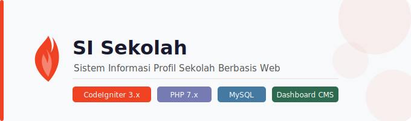

<p align="center">
  
</p>

# 🏫 SI Sekolah — Sistem Informasi Profil Sekolah

Aplikasi web berbasis **CodeIgniter 3** untuk mengelola dan menampilkan profil sekolah secara dinamis. Dilengkapi dengan dashboard admin untuk manajemen konten dan berbagai fitur keamanan.

---

## 📋 Fitur Utama

### Halaman Publik
- Profil sekolah (visi, misi, sambutan kepala sekolah)
- Carousel / slider banner
- Artikel & berita sekolah
- Galeri foto
- Data sarana & prasarana

### Dashboard Admin
- Manajemen profil sekolah
- Manajemen artikel (dengan slug otomatis & view counter)
- Manajemen carousel
- Manajemen galeri
- Manajemen sarana & prasarana
- Manajemen akun pengguna (admin & kontributor)

---

## 🔐 Fitur Keamanan

| Fitur | Keterangan |
|---|---|
| **XSS Protection** | Filter input untuk mencegah Cross-Site Scripting |
| **SQL Injection Prevention** | Query menggunakan Active Record / prepared statement CI3 |
| **CSRF Protection** | Token CSRF pada setiap form |
| **Password Hashing** | Password disimpan dalam bentuk hash |
| **MIME Type Validation** | Validasi tipe file upload berdasarkan MIME, bukan ekstensi |
| **File Upload Validation** | Pembatasan ekstensi, ukuran, dan tipe file |
| **Encrypted Filename** | Nama file upload dienkripsi untuk mencegah path guessing |

---

## 🗄️ Struktur Database

```sql
user           — Data akun pengguna (admin & kontributor)
artikel        — Artikel/berita sekolah
carousel       — Konten slider halaman utama
galeri         — Galeri foto
profil         — Profil lengkap sekolah
sarana_prasarana — Data inventaris sarana dan prasarana
```

### Diagram Relasi

```
user ──< artikel
user ──< galeri
user ──< profil
user ──< sarana_prasarana
```

---

## 🛠️ Teknologi

- **Backend:** PHP, CodeIgniter 3
- **Database:** MySQL / MariaDB
- **Frontend:** HTML, CSS, JavaScript
- **Server:** Apache (XAMPP / Laragon)

---

## ⚙️ Instalasi

### Prasyarat
- PHP >= 7.x
- MySQL / MariaDB
- Web server (Apache/Nginx) atau XAMPP/Laragon

### Langkah Instalasi

1. **Clone repository**
   ```bash
   git clone https://github.com/NickyIno/ci3-si-sekolah.git
   cd ci3-si-sekolah
   ```

2. **Import database**

   Buat database baru di MySQL, lalu import file SQL:
   ```bash
   mysql -u root -p nama_database < database/si_sekolah.sql
   ```

   Atau jalankan query berikut secara manual:
   ```sql
   CREATE TABLE `user` (
     `id` int NOT NULL AUTO_INCREMENT PRIMARY KEY,
     `nama` varchar(50) NOT NULL,
     `username` varchar(50) NOT NULL,
     `password` varchar(255) NOT NULL,
     `role` enum('admin','kontributor') NOT NULL
   ) ENGINE=InnoDB DEFAULT CHARSET=utf8mb4;

   CREATE TABLE `artikel` (
     `id` int NOT NULL AUTO_INCREMENT PRIMARY KEY,
     `judul` varchar(100) NOT NULL,
     `slug` varchar(100) NOT NULL,
     `gambar` varchar(100) NOT NULL,
     `deskripsi` text,
     `tanggal` datetime DEFAULT CURRENT_TIMESTAMP,
     `user_id` int DEFAULT NULL,
     `viewer` int DEFAULT '0',
     FOREIGN KEY (`user_id`) REFERENCES `user`(`id`) ON DELETE CASCADE ON UPDATE CASCADE
   ) ENGINE=InnoDB DEFAULT CHARSET=utf8mb4;

   CREATE TABLE `carousel` (
     `id` int NOT NULL AUTO_INCREMENT PRIMARY KEY,
     `judul` varchar(30) NOT NULL,
     `gambar` varchar(100) DEFAULT NULL,
     `deskripsi` varchar(100) DEFAULT NULL
   ) ENGINE=InnoDB DEFAULT CHARSET=utf8mb4;

   CREATE TABLE `galeri` (
     `id` int NOT NULL AUTO_INCREMENT PRIMARY KEY,
     `judul` varchar(100) NOT NULL,
     `gambar` varchar(100) DEFAULT NULL,
     `tanggal` datetime DEFAULT CURRENT_TIMESTAMP,
     `user_id` int DEFAULT NULL,
     FOREIGN KEY (`user_id`) REFERENCES `user`(`id`) ON DELETE CASCADE ON UPDATE CASCADE
   ) ENGINE=InnoDB DEFAULT CHARSET=utf8mb4;

   CREATE TABLE `profil` (
     `id` int NOT NULL AUTO_INCREMENT PRIMARY KEY,
     `user_id` int DEFAULT NULL,
     `nama_sekolah` varchar(150) DEFAULT NULL,
     `visi` text,
     `misi` text,
     `kepala_sekolah` varchar(100) DEFAULT NULL,
     `profil` text,
     `tentang` text,
     `alamat` varchar(255) DEFAULT NULL,
     `logo` varchar(255) DEFAULT NULL,
     `foto_kepala_sekolah` varchar(255) DEFAULT NULL,
     FOREIGN KEY (`user_id`) REFERENCES `user`(`id`) ON DELETE CASCADE ON UPDATE CASCADE
   ) ENGINE=InnoDB DEFAULT CHARSET=utf8mb4;

   CREATE TABLE `sarana_prasarana` (
     `id` int NOT NULL AUTO_INCREMENT PRIMARY KEY,
     `judul` varchar(100) NOT NULL,
     `gambar` varchar(100) DEFAULT NULL,
     `jumlah` int DEFAULT NULL,
     `keadaan` enum('baik','tidak baik') DEFAULT NULL,
     `tanggal` datetime DEFAULT CURRENT_TIMESTAMP,
     `user_id` int DEFAULT NULL,
     FOREIGN KEY (`user_id`) REFERENCES `user`(`id`) ON DELETE CASCADE ON UPDATE CASCADE
   ) ENGINE=InnoDB DEFAULT CHARSET=utf8mb4;
   ```

3. **Konfigurasi database**

   Edit file `application/config/database.php`:
   ```php
   $db['default'] = array(
       'hostname' => 'localhost',
       'username' => 'root',
       'password' => '',
       'database' => 'nama_database',
       // ...
   );
   ```

4. **Konfigurasi base URL**

   Edit file `application/config/config.php`:
   ```php
   $config['base_url'] = 'http://localhost/ci3-si-sekolah/';
   ```

5. **Jalankan aplikasi**

   Akses melalui browser:
   ```
   http://localhost/ci3-si-sekolah
   ```

---

## 👤 Role Pengguna

| Role | Akses |
|---|---|
| **Admin** | Akses penuh ke semua fitur dashboard |
| **Kontributor** | Dapat mengelola konten tertentu (artikel, galeri, dll) |

---

## 📁 Struktur Direktori

```
ci3-si-sekolah/
├── application/
│   ├── config/
│   ├── controllers/
│   ├── models/
│   └── views/
├── assets/
│   ├── css/
│   ├── js/
│   └── img/
├── uploads/
└── index.php
```

---

## 📄 Lisensi

Project ini dibuat untuk keperluan akademik / portofolio.

---

> Dibuat dengan ❤️ menggunakan CodeIgniter 3
